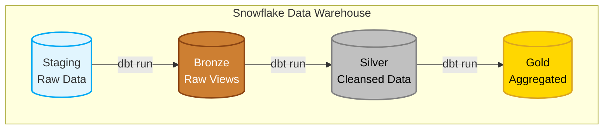

# 🏗️ Data Engineering - Airbnb Data ETL Project

This repository showcases an **end-to-end data transformation pipeline** built using **dbt (data build tool)** and **Snowflake**.  

The project demonstrates how to transform raw **Airbnb** data (listings, bookings, and hosts) into a structured **Bronze–Silver–Gold** (Medallion) architecture for analytics and reporting.

## 🧩 Architecture Overview

Below is the high-level architecture and data flow across the data stack:



### Components:
- **Snowflake:** Serves as the central cloud data platform for scalable storage and compute.  
- **dbt Core:** Handles scalable data transformation using modular SQL, along with data quality testing and documentation.  

## 📁 Project Structure

```text
aws_dbt_snowflake_project_aaron/
├── dbt_project.yml       # Core dbt configuration and materialization logic
├── profiles.yml          # Snowflake connection settings
├── models/
│   ├── sources/          # Source configurations (sources.yml)
│   ├── bronze/           # 1:1 raw views of staging data
│   ├── silver/           # Cleansed, standardized, and joined tables
│   └── gold/             # Business-level aggregates and dimensions
├── tests/                # Custom data quality tests
└── macros/               # Reusable SQL functions
```

## ⚙️ Pipeline Flow

### 1. Extraction & Ingestion
- Raw Airbnb dataset files (Listings, Bookings, Hosts) are ingested into the raw staging layer within Snowflake (`AIRBNB.staging`).

### 2. Transformation (dbt)
- The dbt project performs all transformation logic, including cleaning, joins, and aggregations using SQL. Data flows through the Medallion layers to ensure reliability, consistency, and analytical readiness:
  - **Bronze:** Creates views directly on top of the raw staging tables to serve as a secure entry point for transformations.
  - **Silver:** Cleanses the data, casts data types, handles null values, and enforces naming conventions.
  - **Gold:** Aggregates data into analytical models (e.g., host performance, booking trends) ready for consumption.

### 3. Loading
- The final Gold-layer tables are materialized as physical tables in the `gold` schema within Snowflake, making them highly performant for reporting and analytics.

## 📊 Example Output

*Note: You can add a screenshot of your Snowflake `gold` schema here.*
<!--  -->

## 🧰 Tech Stack

| Layer | Tool / Service | Purpose |
|-------|----------------|----------|
| **Data Warehouse** | Snowflake | Scalable cloud storage, compute, and serving |
| **Transformation** | dbt (data build tool) | SQL-based data modeling, testing, and documentation |
| **Version Control** | Git / GitHub | Code tracking and collaboration |
| **Testing** | dbt Tests | Unit testing & data validation (Uniqueness, Not Null, etc.) |

## 📚 Reference

This project processes Airbnb listings, hosts, and bookings data to demonstrate real-world data modeling, testing, and analytics workflows.

- Ensure your Snowflake credentials are setup correctly in `profiles.yml`
- To run the pipeline, execute: `dbt run`
- To run tests, execute: `dbt test`
